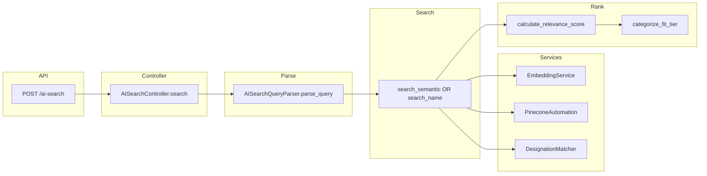
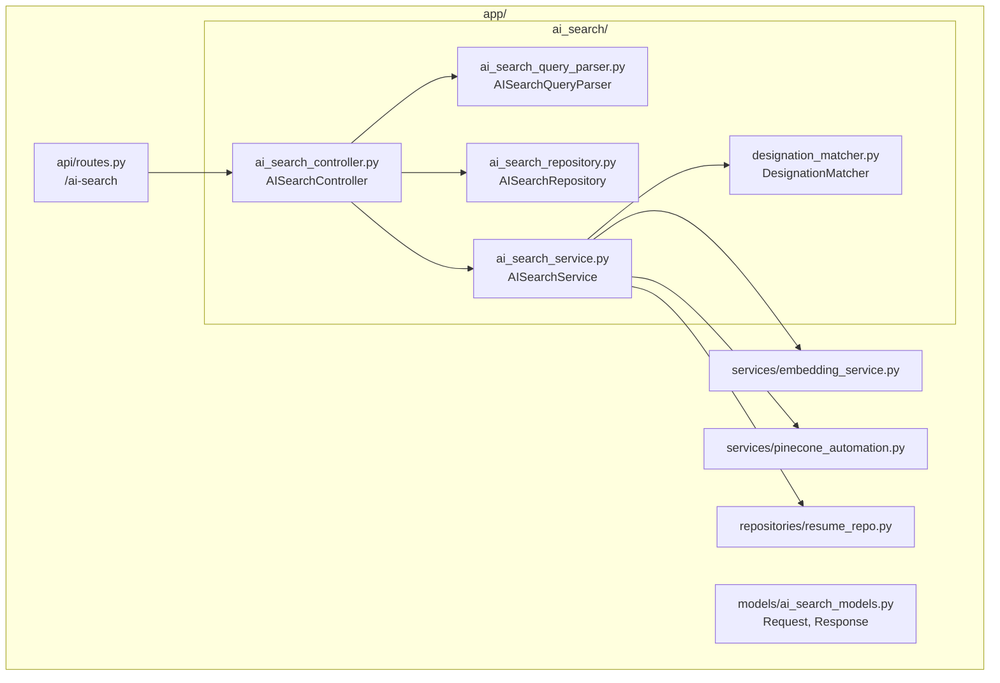
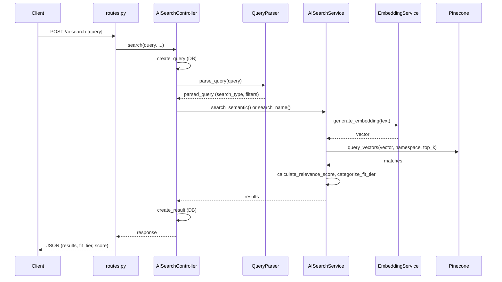
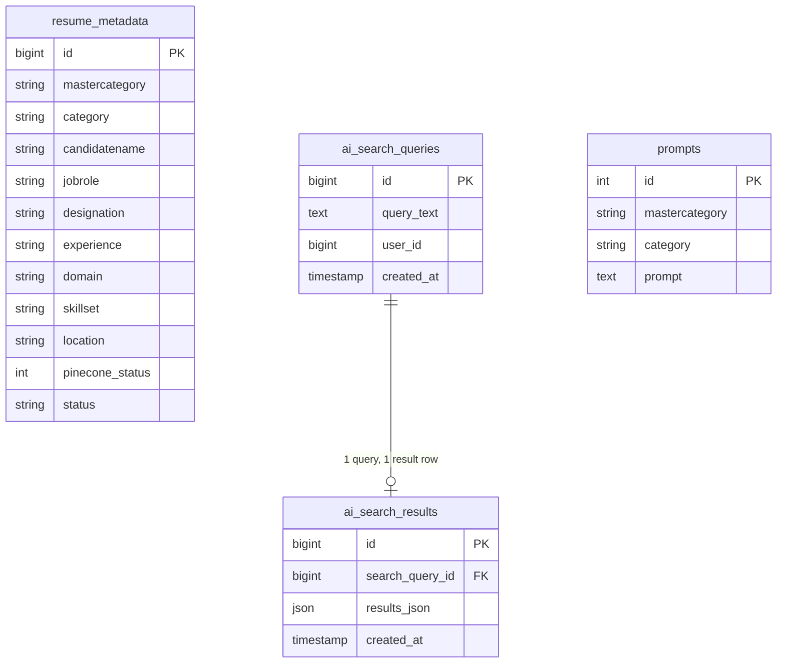
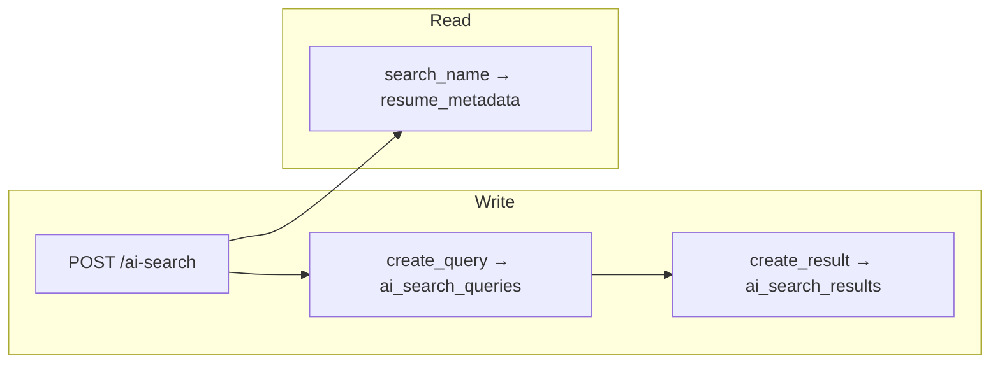

# AI-Based Search and Ranking for ATS

## One-Page Executive Summary

The ATS provides **AI-powered candidate search** so recruiters can use natural language or boolean queries instead of rigid filters. The system:

1. **Parses** the query with an LLM (OLLAMA or OpenAI) into structured intent: role, skills, experience, location, domain, and whether the user is searching by **name** or by **semantic** criteria.
2. **Searches** either by **name** (SQL + token/phonetic matching) or by **semantic similarity** (embeddings + Pinecone vector search), with optional scoping to a single category (explicit mode) or across relevant categories (broad mode).
3. **Ranks** each candidate using a **combined score**: vector similarity (0–100) plus a **relevance score** (0–100) from skills, role, experience, and category. Results are grouped into **fit tiers**: **Perfect Match**, **Good Match**, **Partial Match**, **Low Match**.

**Design principle:** *Ranking over filtering—optimize for recall and relevance, not strict exclusion.*

**Stack:** Embeddings via OLLAMA (e.g. nomic-embed-text), Pinecone (IT/NON_IT indexes, category namespaces), LLM for query parsing. No code changes required for this document.

**Documentation practice:** Keep code structure screenshots (e.g. of the `app/ai_search` module layout, key classes, and request→parse→search→rank flow) alongside this document for quick reference and onboarding.

---

## Code structure (KT for new joiners)

Below diagrams help new joiners understand where AI search lives in the codebase and how a request flows end-to-end.

### 1. Module / package structure (ASCII)

```
app/
├── api/
│   └── routes.py                    # POST /ai-search → ai_search()
├── models/
│   └── ai_search_models.py          # AISearchRequest, AISearchResponse, CandidateResult
│
├── ai_search/                       # ← AI search module
│   ├── __init__.py
│   ├── ai_search_controller.py      # AISearchController — entry point, orchestrates flow
│   ├── ai_search_query_parser.py    # AISearchQueryParser — LLM parse (OLLAMA/OpenAI)
│   ├── ai_search_service.py         # AISearchService — search_semantic, search_name, scoring, fit tiers
│   ├── ai_search_repository.py      # AISearchRepository — DB: create_query, create_result
│   └── designation_matcher.py      # DesignationMatcher — expand role to equivalent titles
│
├── services/
│   ├── embedding_service.py         # EmbeddingService — generate_embedding (OLLAMA)
│   └── pinecone_automation.py       # PineconeAutomation — query_vectors, index (IT/NON_IT)
│
└── repositories/
    └── resume_repo.py               # ResumeRepository — used for name search / resume lookup
```

### 2. Request flow — sequence (ASCII)

```
  Client          routes.py    AISearchController    QueryParser    AISearchService      Embedding    Pinecone    DB
    |                  |                |                |                |                  |           |        |
    |  POST /ai-search  |                |                |                |                  |           |        |
    |  {query,...}     |                |                |                |                  |           |        |
    |----------------->|                |                |                |                  |           |        |
    |                  |  controller.   |                |                |                  |           |        |
    |                  |  search(...)   |                |                |                  |           |        |
    |                  |-------------->|                |                |                  |           |        |
    |                  |                | create_query   |                |                  |           |        |
    |                  |                |----------------------------------------------->   |           |        |
    |                  |                |                |                |                  |           |   persist query
    |                  |                | parse_query()  |                |                  |           |        |
    |                  |                |--------------->|  LLM call      |                  |           |        |
    |                  |                |                | (OLLAMA/OpenAI)|                  |           |        |
    |                  |                |<---------------|  parsed_query   |                  |           |        |
    |                  |                |                |                |                  |           |        |
    |                  |                | search_semantic() or search_name()                |           |        |
    |                  |                |--------------------------------->|                |           |        |
    |                  |                |                |                | generate_embedding|           |        |
    |                  |                |                |                |----------------->|           |        |
    |                  |                |                |                |<-----------------|           |        |
    |                  |                |                |                | query_vectors    |           |        |
    |                  |                |                |                |--------------------------------->|        |
    |                  |                |                |                |<---------------------------------|        |
    |                  |                |                |                | calculate_relevance_score       |        |
    |                  |                |                |                | categorize_fit_tier             |        |
    |                  |                |<---------------------------------|                |           |        |
    |                  |                | create_result (save results)     |                  |           |        |
    |                  |                |--------------------------------------------------------------->|
    |                  |<---------------|  response       |                |                  |           |        |
    |<------------------|  JSON         |                |                |                  |           |        |
```

### 3. Component dependency diagram (ASCII)

```
                    ┌─────────────────────────────────────────────────────────┐
                    │                    POST /ai-search                       │
                    │                  (app/api/routes.py)                     │
                    └────────────────────────────┬────────────────────────────┘
                                                 │
                                                 ▼
                    ┌─────────────────────────────────────────────────────────┐
                    │                  AISearchController                      │
                    │            (ai_search/ai_search_controller.py)           │
                    │  • search()  • create_query  • parse  • search  • format  │
                    └───┬──────────────────────────┬─────────────────────┬────┘
                        │                          │                     │
        ┌───────────────▼───────────────┐  ┌───────▼────────┐  ┌─────────▼─────────────┐
        │   AISearchRepository          │  │ AISearchQuery  │  │   AISearchService      │
        │   (ai_search_repository.py)    │  │ Parser         │  │   (ai_search_service  │
        │   • create_query()             │  │ (query_parser  │  │    .py)               │
        │   • create_result()            │  │  .py)          │  │ • search_semantic()   │
        └───────────────────────────────┘  │ • parse_query() │  │ • search_name()       │
                                            └───────┬────────┘  │ • calculate_relevance │
                                                    │           │ • categorize_fit_tier │
                                                    │           └───────┬───────────────┘
                                                    │                   │
                        ┌────────────────────────────┼───────────────────┼────────────────────────────┐
                        │                            │                   │                            │
                        ▼                            ▼                   ▼                            ▼
              ┌─────────────────┐          ┌─────────────────┐  ┌─────────────────┐  ┌─────────────────────┐
              │ EmbeddingService│          │ PineconeAutomation│  │DesignationMatcher│  │  ResumeRepository   │
              │ (services/      │          │ (services/        │  │ (designation_   │  │  (resume_repo)      │
              │  embedding_     │          │  pinecone_       │  │  matcher.py)     │  │  name search path   │
              │  service.py)    │          │  automation.py)  │  │ • expand_design. │  │                     │
              │ • generate_     │          │ • query_vectors()│  │   to_equivalent  │  │                     │
              │   embedding()   │          │ • IT/NON_IT idx  │  │   _roles()       │  │                     │
              └─────────────────┘          └─────────────────┘  └─────────────────┘  └─────────────────────┘
```

### 4. Mermaid diagrams (for Confluence / GitHub / Notion)

Copy the blocks below into a Mermaid-supported editor to get a visual diagram.

**Flow diagram (request → response):**



**Module structure (folder view):**



**Sequence (simplified):**



---

## Database structure (KT for new joiners)

Below diagrams describe the tables and relationships used by the ATS, including AI search. All models live in `app/database/models.py`.

### 1. Tables and columns (ASCII)

```
app/database/models.py
────────────────────────────────────────────────────────────────────────────────

┌─ resume_metadata ─────────────────────────────────────────────────────────────┐
│ PK  id                 INTEGER, autoincrement                                 │
│     mastercategory     VARCHAR(255)   -- IT | NON_IT                           │
│     category           VARCHAR(255)   -- e.g. Full Stack Development (Python)│
│     candidatename      VARCHAR(255)   -- candidate name (used in name search)   │
│     jobrole            VARCHAR(255)                                            │
│     designation        VARCHAR(255)   -- current/most recent job title          │
│     experience         VARCHAR(100)   -- e.g. "5 years", "10+"                 │
│     domain             VARCHAR(255)   -- industry/domain                        │
│     mobile             VARCHAR(50)                                             │
│     email              VARCHAR(255)                                             │
│     education          TEXT                                                    │
│     location           VARCHAR(255)   -- city, state, country                  │
│     filename           VARCHAR(512)   NOT NULL                                 │
│     skillset           TEXT           -- comma-separated or list               │
│     status             VARCHAR(50)    default 'pending'  -- processing status  │
│     resume_text        TEXT           -- full extracted text                  │
│     pinecone_status    INTEGER        default 0   -- 0=not indexed, 1=indexed  │
│     created_at         TIMESTAMP      default current_timestamp                 │
│     updated_at         TIMESTAMP      default current_timestamp, on update      │
└────────────────────────────────────────────────────────────────────────────────┘
  ↑ Source for: resume upload/parsing, Pinecone indexing, name search (AI search)

┌─ prompts ────────────────────────────────────────────────────────────────────┐
│ PK  id                 INTEGER, autoincrement                                   │
│     mastercategory     VARCHAR(255)   -- IT | NON_IT (for prompt lookup)       │
│     category           VARCHAR(255)   -- category name                         │
│     prompt             TEXT           NOT NULL  -- skills extraction prompt     │
│     created_at         TIMESTAMP      default current_timestamp                 │
│     updated_at         TIMESTAMP      default current_timestamp, on update       │
└────────────────────────────────────────────────────────────────────────────────┘
  ↑ Used by: skills extraction / prompts service (not directly by AI search)

┌─ ai_search_queries ───────────────────────────────────────────────────────────┐
│ PK  id                 BIGINT, autoincrement                                    │
│     query_text         TEXT           NOT NULL  -- raw natural language query   │
│     created_at         TIMESTAMP      default current_timestamp                 │
│     user_id            BIGINT         nullable  -- optional user tracking     │
└────────────────────────────────────────────────────────────────────────────────┘
  ↑ Written by: AISearchController.create_query() at start of each /ai-search call

┌─ ai_search_results ────────────────────────────────────────────────────────────┐
│ PK  id                 BIGINT, autoincrement                                    │
│ FK  search_query_id    BIGINT         NOT NULL  → ai_search_queries.id         │
│     results_json       JSON           NOT NULL  -- { total_results, results[] } │
│     created_at         TIMESTAMP      default current_timestamp                 │
└────────────────────────────────────────────────────────────────────────────────┘
  ↑ Written by: AISearchController.create_result() after search completes
```

### 2. Relationships (ASCII)

```
                    ┌─────────────────────┐
                    │   resume_metadata   │
                    │   (candidates)      │
                    └──────────┬─────────┘
                               │
         • Name search (AI): SELECT by candidatename (token/Soundex)
         • Pinecone index built from resume_metadata (metadata stored in vector DB)
         • Job match / parse-JD: fetch by resume_id from Pinecone results
                               │
                               │  (no FK; referenced by resume_id in Pinecone
                               │   and in results_json.results[].resume_id)
                               │
    ┌─────────────────────────┼─────────────────────────┐
    │                          │                         │
    ▼                          │                         ▼
┌───────────────┐              │              ┌─────────────────────┐
│   prompts     │              │              │  ai_search_queries   │
│ (IT/NON_IT,   │              │              │  id (PK)            │
│  category)    │              │              │  query_text         │
└───────────────┘              │              │  user_id, created_at│
                               │              └──────────┬──────────┘
                               │                         │
                               │                         │ 1 : 1 (per request)
                               │                         ▼
                               │              ┌─────────────────────┐
                               │              │  ai_search_results   │
                               │              │  id (PK)             │
                               └─────────────│  search_query_id (FK)│
                                             │  results_json       │
                                             └─────────────────────┘
```

### 3. Where each table is used (AI search context)

| Table | Used by | Purpose |
|-------|---------|---------|
| **resume_metadata** | `AISearchService.search_name()`, `ResumeRepository` | Name search: filter by `candidatename` (token + Soundex). Also source for Pinecone metadata when indexing. |
| **ai_search_queries** | `AISearchRepository.create_query()` | Persist each `/ai-search` request (query_text, user_id) and get `id` for linking results. |
| **ai_search_results** | `AISearchRepository.create_result()` | Persist snapshot of results (search_query_id, results_json) after each search. |
| **prompts** | Skills service / extraction | Not used by AI search; used for resume skills extraction prompts. |

### 4. Mermaid diagrams (for Confluence / GitHub / Notion)

**Entity-relationship:**



**Flow: AI search and DB (simplified):**



---

## Full Document

### 1. Overview

The ATS uses an **AI-powered search and ranking** pipeline so recruiters can search candidates in natural language. The system:

- **Interprets intent** from free-text or boolean queries (role, skills, experience, location, domain).
- **Searches** using both **semantic (vector) search** and **name search**, with optional category scoping.
- **Ranks** candidates by a **combined relevance score** and assigns **fit tiers** (Perfect Match, Good Match, Partial Match, Low Match).

Design principle (from the system prompt): *"Ranking is more important than filtering. Optimize for recall and relevance, not strict exclusion."*

---

### 2. High-Level Architecture

| Layer | Component | Responsibility |
|-------|------------|----------------|
| **API / Controller** | `AISearchController` | Receives query + optional `mastercategory`/`category`; orchestrates parse → search → format; persists query and returns results. |
| **Query parsing** | `AISearchQueryParser` | Converts natural language/boolean query into structured JSON using LLM (OLLAMA or OpenAI). Outputs `search_type`, `text_for_embedding`, and `filters`. |
| **Search execution** | `AISearchService` | Runs **semantic search** (Pinecone + embeddings) or **name search** (SQL + token/phonetic matching). |
| **Embeddings** | `EmbeddingService` | Generates vector for `text_for_embedding` (OLLAMA: e.g. `nomic-embed-text` / `mxbai-embed-large`). |
| **Vector store** | `PineconeAutomation` | Stores and queries resume vectors by index (IT/NON_IT) and namespace (category). |
| **Ranking** | `AISearchService` | Combines **semantic score** and **relevance score**; assigns **fit tier** per candidate. |

---

### 3. Query Parsing (LLM)

- **Role**: Turn recruiter input into a **strict, literal** structured representation—no invented skills or inferred experience.
- **Output** (simplified):
  - **search_type**: `"semantic"` | `"name"` | `"hybrid"`.
  - **text_for_embedding**: Lowercase text used for vector search (role + skills + experience/location as applicable).
  - **filters**: `designation`, `must_have_all`, `must_have_one_of_groups`, `min_experience`, `max_experience`, `domain`, `location`, `candidate_name`.
- **Rules** (from prompt): Job titles stay in `designation` (not split into skills); experience only when numeric (e.g. "5 years"); boolean logic (AND/OR) preserved; domain/location only when clearly stated.

Name search is chosen only when the query is clearly a **full name** with no other content.

---

### 4. Search Modes

#### 4.1 Explicit mode (category scoped)

- **When**: `mastercategory` and `category` are provided by the client.
- **Behavior**: Search is restricted to that **index** (IT or NON_IT) and **namespace** (category). No fallback to other namespaces.
- **Use case**: UI has already selected a category; search is scoped to that category only.

#### 4.2 Broad mode

- **When**: `mastercategory`/`category` are not both provided.
- **Behavior**: “Smart” selection of namespaces (e.g. role-family → list of namespaces, or multiple namespaces) to maximize recall across categories.
- **Use case**: Recruiter types a free-text query without picking a category.

#### 4.3 Search types

- **semantic**: Vector search in Pinecone using `text_for_embedding`; filters (e.g. experience, location) can be applied in Pinecone and/or in post-processing.
- **name**: SQL-based search by `candidate_name` (token + phonetic/Soundex-style matching), no vector search.
- **hybrid**: Treated like semantic in the current flow (same as semantic path).

---

### 5. Semantic Search Flow

1. **Embedding**: `text_for_embedding` → vector via `EmbeddingService` (OLLAMA).
2. **Pinecone query**: Vector is queried against the chosen index(es) and namespace(s), with optional Pinecone filter (e.g. experience range, location).
3. **Results**: Top-k matches with metadata (resume_id, designation, skills, experience_years, category, mastercategory, etc.).
4. **Relevance scoring**: Each candidate is scored by `calculate_relevance_score()` (see below).
5. **Combined score**: `semantic_score` (0–1 from Pinecone) is scaled to 0–100 and added to `relevance_score` (0–100) → **combined_score** (0–200).
6. **Fit tier**: `categorize_fit_tier()` maps combined score and rules (role, skills, experience) to **Perfect Match / Good Match / Partial Match / Low Match**.
7. **Filtering**: In explicit mode, candidates can be filtered by query role/designation (including designation equivalents from `DesignationMatcher`).

---

### 6. Relevance Scoring (`calculate_relevance_score`)

Relevance is a **0–100** score (higher = better) from structured signals. It is **additive and subtractive** (can go negative for hard mismatches).

- **Strict category/mastercategory** (explicit mode): Wrong mastercategory → **-100** (excluded); wrong category → **-30**.
- **Skills**:  
  - `must_have_all`: proportion matched × 40 (max 40).  
  - `must_have_one_of_groups`: best group’s proportion × 30 (max 30).
- **QA-style queries**: Extra boost for QA/automation-related skills (e.g. Selenium, TestNG).
- **Domain**: Exact match +12; partial +6.
- **Designation/role**: Rule-based match (normalized + substring) → +15 to +50 by confidence; mismatch → **-40**.
- **Experience**: Exact match to min +18; ±1 year +14; ±2 years +10; above band +4; too low **-15**. Max experience (range) small penalty/bonus.
- **Mastercategory** (broad mode): Mismatch **-50**; match +10.

So relevance encodes **skills, role, experience, domain, and category** without relying only on the vector.

---

### 7. Fit Tiers (`categorize_fit_tier`)

- **Input**: Candidate, parsed query, **combined_score** (0–200).
- **Normalization**: `normalized_score = combined_score / 200` (0–1).

Rules (simplified):

- **Hard demotions**: Wrong mastercategory → Low Match. Query wants professional role but candidate is student/intern/trainee → Low Match. Query has a designation and candidate role is recognized but **not** in the same normalized role family → Low Match.
- **Role + experience**: If query role and candidate role match exactly (normalized): experience ≥ min → **Perfect Match**; else **Good Match**.
- **Skill-based promotion**: If required skills (must_have_all and must_have_one_of_groups) are satisfied and role is relevant (or no role specified), tiers can be promoted (e.g. at least Partial Match) even with lower normalized score.
- **Score bands**:  
  - normalized_score ≥ 0.85 → Perfect Match  
  - ≥ 0.70 → Good Match  
  - ≥ 0.50 → Partial Match  
  - else → Low Match  

So fit tier combines **score bands** with **role**, **experience**, and **skill** rules.

---

### 8. Name Search

- **When**: Parser sets `search_type == "name"` and `filters.candidate_name` is set.
- **How**: Token-based + optional phonetic (e.g. Soundex) matching in SQL; results scored by match type (exact > partial > phonetic) and sorted; fit tier derived from that score.
- **Principle**: “Never invent or assume”—only explicit name match.

---

### 9. Supporting Components

- **DesignationMatcher**: Expands a query designation to equivalent job titles (e.g. “QA” → “QA Automation Engineer”, “SDET”, …) for filtering and role gating; can use LLM for expansion.
- **Role normalization**: `ROLE_NORMALIZATION` and `_normalize_role()` map many job title variants to a canonical role for strict matching and tier logic.
- **Namespace mapping**: `ROLE_FAMILY_NAMESPACES` maps role families (e.g. “qa”, “software_engineer”) to Pinecone namespaces for broad-mode namespace selection.
- **Skill normalization**: `normalize_skill_list()` (and cleaning utils) standardize skills for matching in relevance and fit tier.

---

### 10. Technology Stack

- **Embeddings**: OLLAMA (`nomic-embed-text` / `mxbai-embed-large`); normalized vectors.
- **Vector DB**: Pinecone (indexes: IT / NON_IT; namespaces by category).
- **Query parsing**: OLLAMA or OpenAI (configurable) with a strict JSON prompt.
- **Backend**: Python (FastAPI), async; repository layer for saving search queries and results.

---

### 11. Summary Table

| Aspect | Implementation |
|--------|----------------|
| **Query understanding** | LLM-based parser → structured JSON (search_type, text_for_embedding, filters). |
| **Semantic search** | Embedding of `text_for_embedding` → Pinecone top-k by index/namespace. |
| **Name search** | SQL with token + phonetic matching, no vectors. |
| **Ranking** | Combined score = semantic (0–100) + relevance (0–100); then fit tier from score + role/skills/experience rules. |
| **Relevance signals** | Skills, designation, experience, domain, category/mastercategory; rule-based (no LLM at scoring time for scale). |
| **Fit tiers** | Perfect / Good / Partial / Low Match from normalized score and hard rules (role, experience, skills). |
| **Modes** | Explicit (single category) vs broad (multiple namespaces by role-family). |

---

## API Reference

### Endpoint

`POST /ai-search`

AI-powered candidate search using natural language. Parses the query, runs semantic or name search, ranks by relevance, and returns candidates with fit tiers.

### Request body (`AISearchRequest`)

| Field | Type | Required | Description |
|-------|------|----------|-------------|
| `query` | string | Yes | Natural language search query (e.g. "python developer with 5 years experience", "QA AND Selenium", "John Smith"). |
| `mastercategory` | string | No | `"IT"` or `"NON_IT"`. If provided with `category`, restricts search to that index. |
| `category` | string | No | Category namespace (e.g. "Full Stack Development (Python)"). If provided with `mastercategory`, restricts search to that namespace. |
| `user_id` | integer | No | Optional user ID for tracking. |
| `top_k` | integer | No | Number of results to return (default: 20). |

**Note:** If both `mastercategory` and `category` are provided, search is **explicit** (only that namespace). Otherwise, search is **broad** across relevant namespaces.

### Response (`AISearchResponse`)

| Field | Type | Description |
|-------|------|-------------|
| `query` | string | Original query. |
| `mastercategory` | string \| null | Mastercategory used (null if broad search). |
| `category` | string \| null | Category used (null if broad search). |
| `total_results` | integer | Number of candidates returned. |
| `results` | array | List of `CandidateResult` (see below). |

**CandidateResult**

| Field | Type | Description |
|-------|------|-------------|
| `candidate_id` | string | Candidate identifier (e.g. C123). |
| `resume_id` | integer \| null | Resume ID. |
| `name` | string | Candidate name. |
| `category` | string \| null | Resume category. |
| `mastercategory` | string \| null | IT / NON_IT. |
| `designation` | string \| null | Job title/designation. |
| `jobrole` | string \| null | Job role. |
| `experience_years` | integer \| null | Years of experience. |
| `skills` | string[] | List of skills. |
| `location` | string \| null | Location. |
| `score` | number | Combined relevance score as percentage (0–100). Higher is better. |
| `fit_tier` | string | `"Perfect Match"`, `"Good Match"`, `"Partial Match"`, or `"Low Match"`. |

### Example 1: Broad semantic search

**Request**

```http
POST /ai-search
Content-Type: application/json

{
  "query": "python developer with 5 years experience and Django",
  "top_k": 10
}
```

**Response (200)**

```json
{
  "query": "python developer with 5 years experience and Django",
  "mastercategory": null,
  "category": null,
  "total_results": 10,
  "results": [
    {
      "candidate_id": "C1042",
      "resume_id": 1042,
      "name": "Jane Doe",
      "category": "Full Stack Development (Python)",
      "mastercategory": "IT",
      "designation": "Senior Software Engineer",
      "jobrole": "Python Developer",
      "experience_years": 6,
      "skills": ["Python", "Django", "PostgreSQL", "AWS"],
      "location": "Bangalore",
      "score": 87.5,
      "fit_tier": "Perfect Match"
    }
  ]
}
```

### Example 2: Explicit category (scoped to one namespace)

**Request**

```http
POST /ai-search
Content-Type: application/json

{
  "query": "QA automation engineer with Selenium",
  "mastercategory": "IT",
  "category": "Full Stack Development (Selenium)",
  "top_k": 20
}
```

**Response (200)**

```json
{
  "query": "QA automation engineer with Selenium",
  "mastercategory": "IT",
  "category": "Full Stack Development (Selenium)",
  "total_results": 15,
  "results": [
    {
      "candidate_id": "C2055",
      "resume_id": 2055,
      "name": "John Smith",
      "category": "Full Stack Development (Selenium)",
      "mastercategory": "IT",
      "designation": "QA Automation Engineer",
      "jobrole": "QA Engineer",
      "experience_years": 4,
      "skills": ["Selenium", "Java", "TestNG", "Cucumber"],
      "location": null,
      "score": 92.0,
      "fit_tier": "Perfect Match"
    }
  ]
}
```

### Example 3: Name search

**Request**

```http
POST /ai-search
Content-Type: application/json

{
  "query": "Priya Sharma",
  "top_k": 5
}
```

**Response (200)**

```json
{
  "query": "Priya Sharma",
  "mastercategory": null,
  "category": null,
  "total_results": 2,
  "results": [
    {
      "candidate_id": "C3011",
      "resume_id": 3011,
      "name": "Priya Sharma",
      "category": "Data Science",
      "mastercategory": "IT",
      "designation": "Data Scientist",
      "jobrole": null,
      "experience_years": 5,
      "skills": ["Python", "ML", "SQL"],
      "location": "Mumbai",
      "score": 100.0,
      "fit_tier": "Perfect Match"
    }
  ]
}
```

### Error responses

- **400 Bad Request** – Query parsing failed (e.g. LLM returned invalid JSON or unsupported structure). Response body: `{ "detail": "Query parsing failed: ..." }`.
- **500 Internal Server Error** – Search execution failed (e.g. Pinecone/embedding/DB error). Response body: `{ "detail": "Search failed: ..." }`.
